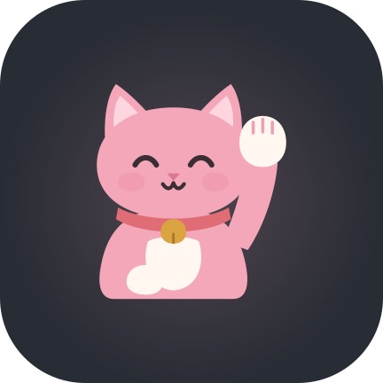
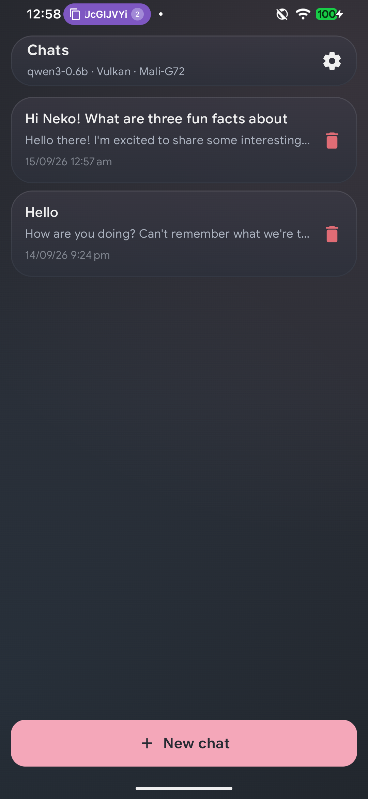
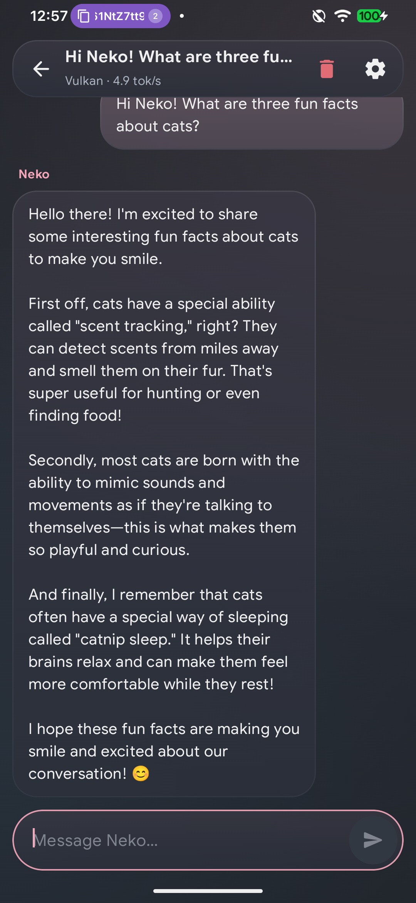
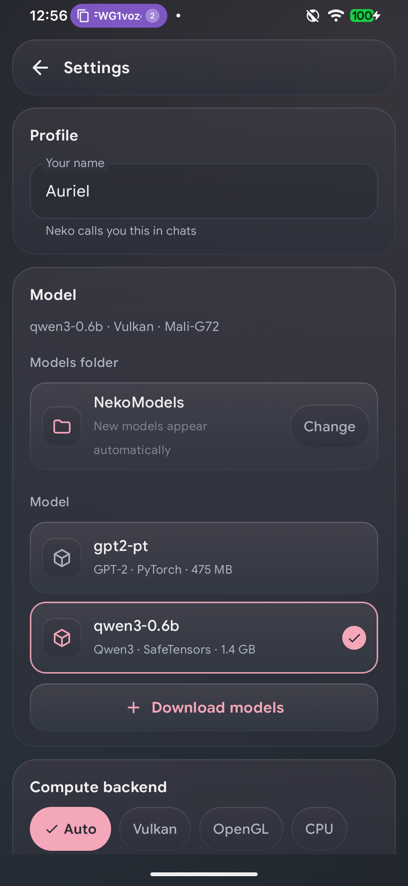
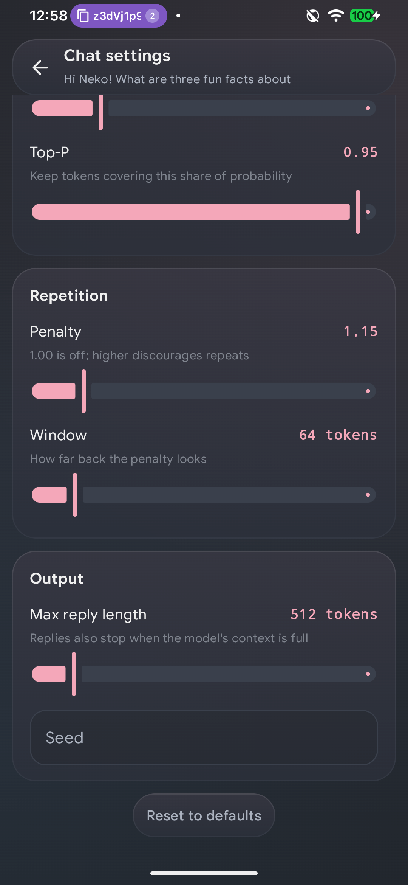
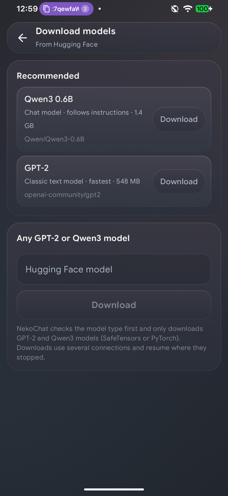
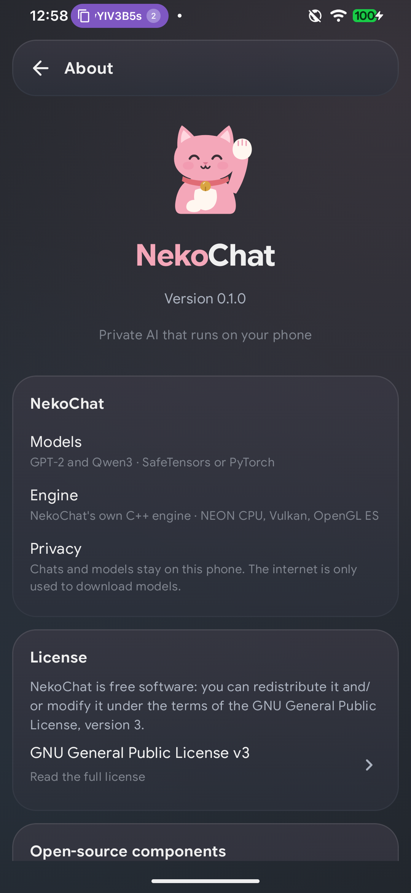
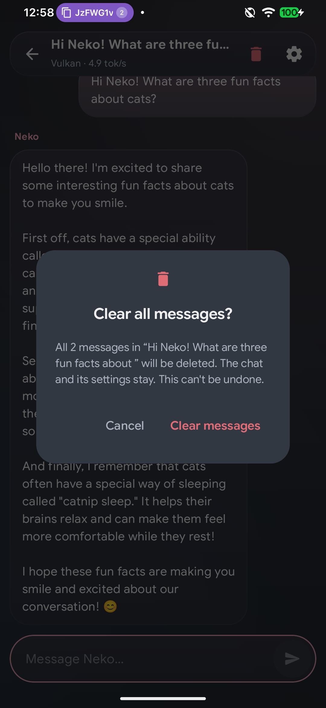

<!-- Layout uses HTML attributes only (align/width/height): GitHub strips CSS from READMEs. -->
<p align="center">
  
</p>

<h1 align="center">NekoChat</h1>

<p align="center">
  <b>Private, on-device AI chat for Android.</b><br>
  GPT-2 and Qwen3 models from <code>.safetensors</code> or <code>.pt</code>, on a custom C++ engine running on Vulkan, OpenGL ES or the CPU.
</p>

<p align="center">
  <sub>Kotlin · Jetpack Compose · Room · JNI · C++17 · Vulkan · OpenGL ES 3.1 · NEON · aria2</sub>
</p>

<table align="center">
  <tr>
    <td align="center"><br><sub><b>Chats</b>: home screen</sub></td>
    <td align="center"><br><sub><b>Chat</b>: Qwen3-0.6B, streaming</sub></td>
    <td align="center"><br><sub><b>Settings</b>: name, folder, model</sub></td>
  </tr>
  <tr>
    <td align="center"><br><sub><b>Chat settings</b>: per chat</sub></td>
    <td align="center"><br><sub><b>Download models</b>: Hugging Face</sub></td>
    <td align="center"><br><sub><b>About</b>: version, licenses</sub></td>
  </tr>
  <tr>
    <td align="center"><br><sub><b>Destructive actions</b> ask first</sub></td>
    <td align="center" colspan="2"><sub>Screenshots: Samsung Galaxy M31 (Exynos 9611, Mali-G72), release build, Qwen3-0.6B loaded
      from a folder picked with the system picker and running on Vulkan.</sub></td>
  </tr>
</table>

NekoChat runs local language models with its own C++ inference engine and ships with no ML
framework dependencies. It uses Vulkan, OpenGL ES or the CPU, whichever the device supports.

- **App ID:** `app.auriel.realm.nekochat`
- **Android:** minSdk 21 (Android 5.0, the lowest Jetpack Compose supports), target/compile SDK 36 (Android 16)
- **ABI:** arm64-v8a
- **Supported architectures:** GPT-2 (`model_type: gpt2`, all sizes and fine-tunes) and Qwen3 dense
  models (`model_type: qwen3`, e.g. Qwen3-0.6B / 1.7B / 4B)
- **License:** [GPL-3.0](LICENSE)
- **Branding & UI rules:** [`app/branding/BRANDING+UI.md`](app/branding/BRANDING+UI.md)

## Features

- **First run asks for just a name and a model.** After that NekoChat opens on the chats list;
  name, models folder, model and compute backend are changed in **Settings** (gear icon), which
  also links to the **About** page.
- **Models folder chosen with the system folder picker.** NekoChat keeps read access to that one
  folder and rescans it every 3 s, so new model subfolders appear on their own.
- **Model downloads from Hugging Face** (*Settings → Download models*): one-tap Qwen3-0.6B and
  GPT-2, or any `owner/model` repo. Only GPT-2 and Qwen3 models are accepted: the repo's
  `config.json` is checked before anything is downloaded. Downloads use aria2 (several connections
  per file, resumable, progress notification).
- **Multiple chats**, stored in a Room database together with every preference.
- **Per-chat settings page:** temperature, top-k, top-p, repetition penalty and window, max reply
  length (up to 4096 tokens), seed, persona, chat name.
- **Destructive actions confirm first:** deleting a chat, clearing its messages and cancelling a
  download each show a dialog whose red confirm button names the action.
- **GPU switching.** *Auto* tries Vulkan, then OpenGL ES 3.1, then CPU (NEON). A backend is used
  only after it passes a numerical self-test against the CPU kernels, and failures fall through
  to the next one.
- **KV-cache prefix reuse** across turns: only new tokens are processed.
- **One Dark + pastel-pink glass UI** with the maneki-neko mascot, built to stay cheap (see *Rendering*).

## Adding a model

### Download (easiest)

*Settings → Download models*. Files go to NekoChat's own folder
(`/sdcard/Android/data/app.auriel.realm.nekochat/files/models/`) and the model shows up in the
model list when the download completes. Partial downloads live in `models/.downloads/` until every
file is complete, so a half-downloaded model can never be selected.

### From a folder

1. Put each model in its own folder:

   | File | Required |
   |------|----------|
   | `config.json` | yes (`"model_type": "gpt2"` or `"qwen3"`) |
   | `model.safetensors` (sharded `*.safetensors` also work) **or** `model.pt` / `pytorch_model.bin` / `*.pth` | yes |
   | `vocab.json` + `merges.txt`, **or** `tokenizer.json` | yes |

2. Put those folders inside one parent folder, e.g. `Internal storage/NekoModels/qwen3-0.6b/`.
3. In NekoChat tap **Choose folder** (setup or Settings), then pick the parent folder (`NekoModels`).

Folders that can't be used are listed with the reason, e.g. a missing tokenizer or an
unsupported architecture. The app-private models folder is scanned too (handy for `adb push`).

`.pt` support covers the zip-based `torch.save` format (PyTorch ≥ 1.6), read by a small built-in
pickle reader: plain `state_dict`s and checkpoints wrapping one. Weights may be F32, F16 or BF16
(Qwen3 ships BF16; it is converted to f16 exactly while loading).

### How picked-folder models reach the engine

The native engine memory-maps weight files by path, but the folder picker only grants content
URIs. `ModelRepository.open()` opens each needed file with `ContentResolver.openFileDescriptor`
and builds a temporary directory of symlinks, named after the files, that point to
`/proc/self/fd/N`. The engine's `openReadOnly()` follows those links and `dup`s the already-open
descriptor instead of reopening the path, which scoped storage would deny. Weights are copied into
engine-owned buffers while loading, so the descriptors are closed as soon as the model is ready.

## Chat formats

| Architecture | Prompt | Reply ends at |
|--------------|--------|---------------|
| GPT-2 (base model) | Transcript: persona line, then `Name: …` / `Neko: …` turns | first newline or speaker label |
| Qwen3 | ChatML (`<\|im_start\|>system/user/assistant`) with thinking disabled: the reply starts after an empty `<think></think>` block, as `apply_chat_template(enable_thinking=False)` renders it | `<\|im_end\|>` token |

Typed text can't inject control tokens: `<|` in user text is split before tokenizing.

## Model downloads

The UI depends only on `ModelDownloadService` (start / pause / resume / cancel / dismiss plus a
`StateFlow` of downloads). The current implementation, `Aria2DownloadService`:

- ships the official aria2 1.37.0 Android build as `jniLibs/arm64-v8a/libaria2c.so`, because only
  the native library directory is executable on Android 10+ (`useLegacyPackaging` extracts it);
- starts `aria2c` as a child process with JSON-RPC on `127.0.0.1`, a random port and a random
  secret, `--stop-with-process` so it never outlives the app, 8 connections per file, and a CA
  bundle assembled from Android's trusted roots (HTTPS certificates are verified);
- resolves the file list with the Hugging Face API, keeps the download list in Room, and re-adds
  unfinished files after a restart so aria2 continues from its `.aria2` control files;
- runs a `dataSync` foreground service with a progress notification while anything downloads;
- lets you pick the resolver in *Settings → Downloads*: **System DNS** (default; Android's
  resolver, so Private DNS and VPN DNS apply) or **Built-in DNS** (aria2's c-ares resolver with
  Cloudflare, Google and Quad9). The Hugging Face API lookup that lists a repo's files always uses
  the system resolver.

Swapping aria2 for another downloader means writing one class; the screens don't change.

## Project layout

```
app/
├── branding/                    canonical SVG mascot, app icon, wordmark, palette + BRANDING+UI.md
├── ui/                          Jetpack Compose UI (com.nekochat.ui)
│   ├── MainActivity.kt          navigation: Setup (first run) · Chats → Chat → Chat settings · Settings → About / Download models
│   ├── ChatViewModel.kt         app state, preferences, model loading, generation orchestration
│   ├── ChatStore.kt             one-time import of data saved by pre-Room builds
│   ├── Components.kt            shared components (top bar, buttons, chips, confirm dialog, mascot)
│   ├── ModelPicker.kt           models folder + model list + backend chips (Setup and Settings)
│   ├── SetupScreen.kt / ChatsScreen.kt / ChatScreen.kt / ChatSettingsScreen.kt
│   ├── SettingsScreen.kt / AboutScreen.kt / AddModelsScreen.kt
│   └── theme/Glass.kt           design tokens, glass surfaces, backdrop
├── architecture/
│   ├── CMakeLists.txt           native build + shader embedding
│   ├── shared/
│   │   ├── cpp/                 engine core
│   │   │   ├── model.*          Model interface, backend selection, architecture factory
│   │   │   ├── tensor_store.*   safetensors + torch zip/pickle loaders (mmap, zero copy)
│   │   │   ├── tokenizer.*      byte-level BPE (GPT-2 and Qwen2 pre-tokenizers, hand-written)
│   │   │   ├── cpu_ops.*        NEON kernels (f16 weights, f32 activations, f16 KV cache)
│   │   │   ├── thread_pool.*    worker pool pinned to the performance cores
│   │   │   ├── sampler.*        temperature / top-k / top-p / repetition penalty
│   │   │   ├── engine.*         generation loop, KV prefix reuse, stop tokens, UTF-8 streaming
│   │   │   ├── jni_bridge.cpp   JNI surface
│   │   │   ├── gpu/             compute.h, vk_compute.cpp, gl_compute.cpp, shaders/*.comp
│   │   │   └── tools/cli_main.cpp  on-device validation / benchmark / bisect tool
│   │   └── kotlin/
│   │       ├── engine/          NativeBridge, InferenceEngine, ModelRepository, ChatFormat
│   │       ├── data/            Room database: preferences, chats, messages, downloads
│   │       └── download/        ModelDownloadService, Aria2DownloadService, HuggingFaceHub
│   ├── gpt2/
│   │   ├── cpp/gpt2_model.*     GPT-2 forward pass (CPU + GPU graphs)
│   │   └── kotlin/              Gpt2ChatFormat (transcript prompt, stop sequences)
│   └── qwen3/
│       ├── cpp/qwen3_model.*    Qwen3 forward pass (RMSNorm, GQA + q/k norm, RoPE, SwiGLU)
│       └── kotlin/              Qwen3ChatFormat (ChatML, no-think)
├── schemas/                     Room schema history (commit it)
└── src/main/                    manifest, resources, jniLibs (aria2c), assets/licenses
```

## Threading

| Thread | Work |
|--------|------|
| **main** (UI) | Compose state and layout. Never runs model code. |
| **RenderThread** (HWUI) | GPU rendering of the UI. |
| **neko-inference** | Every JNI call: load, tokenize, generate. Owns the Vulkan device / EGL context. |
| **native workers** | CPU matmul/attention workers, pinned to the performance cores (big/prime cluster). |
| **IO (serial)** | Room writes, in order; the download service's state machine. |
| **aria2c** (child process) | Network transfers, driven over local JSON-RPC. |

Tokens reach the UI through a lock-free `StreamBuffer`. The chat screen samples it once per frame
(`withFrameNanos`), so a fast model can never cause more than one recomposition per vsync.

## GPU backends

Both GPU backends run the **same GLSL kernels** (`architecture/shared/cpp/gpu/shaders`):
embedding gather, LayerNorm/RMSNorm, f16 matmul, KV store, attention, Qwen3 q/k-norm + RoPE, SwiGLU.

- **Vulkan:** kernels are compiled to SPIR-V at build time with the NDK's `glslc`. `libvulkan.so`
  is loaded at runtime with `dlopen`, so devices without Vulkan still start.
- **OpenGL ES 3.1:** the same sources are compiled by the driver at runtime, in a headless EGL
  context. Dispatches are separated with `glMemoryBarrier(GL_ALL_BARRIER_BITS)`, because Mali
  drivers don't reliably honour the narrower storage barrier between back-to-back dispatches.

A whole forward pass is recorded as one command stream, submitted once per token; only the logits
are read back. Weights are packed f16 and the KV cache is f16. Attention walks the cache in tiles
of 1024 keys with an online softmax, so shared memory doesn't limit the context. Large embedding
tables (Qwen3: 152K × 1024) are split across buffers to stay within storage-buffer and dispatch
limits.

| Model | Context (CPU) | Context (GPU) |
|-------|---------------|---------------|
| GPT-2 | 1024 (trained length) | 1024 |
| Qwen3 | 8192 (KV cache committed as it fills) | 4096 |

The GPU self-test runs every kernel (including a chained layernorm → matmul submission and
attention past 1024 keys) against the CPU before a backend is trusted, so driver bugs fall back to
the next backend instead of producing garbage.

## Rendering

Real glassmorphism blurs whatever sits behind each panel, every frame. NekoChat gets the look
without that cost:

- The backdrop is a static One Dark gradient with two faint glows. `drawWithCache` builds it once
  per resize.
- Panels are translucent Surface fills with a faint pink tint and a hairline highlight. No
  `RenderEffect`, no blur passes, no offscreen layers.
- The chat list is a keyed `LazyColumn` with `reverseLayout`. Only the streaming bubble
  recomposes while tokens arrive. The only looping animation is the typing indicator.

## Building

Requirements: Android SDK 36, NDK 28.2.13676358, CMake 3.22.1, JDK 17+.

```sh
./gradlew assembleDebug
adb install -r app/build/outputs/apk/debug/app-debug.apk
```

### Signing release builds

1. Generate a keystore once (`keytool` ships with the JDK). Keep the file and passwords safe:
   every future update must be signed with the same key.

   ```sh
   keytool -genkeypair -v -keystore nekochat-release.jks -alias nekochat \
     -keyalg RSA -keysize 4096 -validity 10000
   ```

   On Windows, if `keytool` isn't on the PATH, call it from the JDK:

   ```powershell
   & "$env:JAVA_HOME\bin\keytool.exe" -genkeypair -v -keystore nekochat-release.jks -alias nekochat -keyalg RSA -keysize 4096 -validity 10000
   ```

2. Create `keystore.properties` in the project root. It's git-ignored, as are `*.jks` files.

   ```properties
   storeFile=nekochat-release.jks
   storePassword=your-store-password
   keyAlias=nekochat
   keyPassword=your-key-password
   ```

3. Build: `./gradlew assembleRelease`, which produces `app/build/outputs/apk/release/app-release.apk`.
   Without `keystore.properties`, release builds fall back to the debug key.

To check a signature: `apksigner verify --print-certs app-release.apk` (from `build-tools`).

### Validating the engine on a device

The CLI checks the tokenizer and greedy decoding against Hugging Face `transformers` output,
reports speed, and can bisect a GPU backend against the CPU layer by layer and op by op (for any
supported architecture):

```sh
cmake -S app/architecture -B build-cli -G Ninja -DNEKO_BUILD_CLI=ON \
  -DCMAKE_TOOLCHAIN_FILE=$ANDROID_NDK/build/cmake/android.toolchain.cmake \
  -DANDROID_ABI=arm64-v8a -DANDROID_PLATFORM=android-21 -DCMAKE_BUILD_TYPE=Release
ninja -C build-cli nekochat_cli
adb push build-cli/nekochat_cli <model-dir> /data/local/tmp/neko/
adb shell /data/local/tmp/neko/nekochat_cli /data/local/tmp/neko/qwen3 --backend vulkan --ref reference.json
adb shell /data/local/tmp/neko/nekochat_cli /data/local/tmp/neko/qwen3 --backend gl --bisect
```

`reference.json` holds tokenizer ids and greedy continuations produced with `transformers`
(float32).

## Measured performance

Samsung Galaxy M31 (Exynos 9611: 4× A73 + 4× A53, Mali-G72 MP3), f16 weights, greedy decode:

| Model | Backend | Decode | Matches HF reference |
|-------|---------|--------|----------------------|
| GPT-2 small (124M) | CPU (NEON, 4 big cores) | ~31 tok/s | ✅ exact |
| GPT-2 small (124M) | Vulkan | ~20.3 tok/s | ✅ exact |
| GPT-2 small (124M) | OpenGL ES 3.1 | ~19.8 tok/s | ✅ exact |
| Qwen3-0.6B | CPU (NEON, 4 big cores) | ~6.1 tok/s | ✅ exact |
| Qwen3-0.6B | Vulkan | ~5.0 tok/s | ✅ exact |
| Qwen3-0.6B | OpenGL ES 3.1 | ~4.7 tok/s | ✅ exact |

"Exact" means identical tokenizer ids and identical greedy continuations, including Qwen3's chat
template ("What is the capital of France?" → "The capital of France is **Paris**."). Decode is
memory-bandwidth bound; on this SoC the big CPU cores beat the small Mali GPU.

## Known limitations

- Qwen3 thinking mode is always off (replies start after an empty `<think></think>`).
- The Qwen tokenizer's NFC normalization isn't applied (typed text is almost always NFC already).
- Downloads need network access for NekoChat; if the phone blocks it (e.g. a per-app network
  restriction), downloads fail with a message naming that cause.

## Roadmap

- Quantized weights (int8 / int4) for larger models
- Optional thinking mode for Qwen3
- Auto mode that benchmarks backends and picks the fastest
- More architectures behind the same `Model` interface

## License

NekoChat is free software under the [GNU General Public License v3](LICENSE).

The APK bundles the official Android build of [aria2](https://aria2.github.io/) 1.37.0
(GPL-2.0-or-later, statically linked with OpenSSL, zlib, expat, c-ares and libssh2). It runs as a
separate program; its license texts ship in `app/src/main/assets/licenses/` and are shown on the
About page.

## Changelog

Full history: [`changelog.txt`](changelog.txt).

### 0.1.0 (2026-09-15)

- Custom C++ engine running **GPT-2** and **Qwen3** from `.safetensors` and `.pt`, matching Hugging
  Face `transformers` greedy output exactly on CPU, Vulkan and OpenGL ES.
- Hugging Face downloads through a `ModelDownloadService` interface (aria2 implementation),
  restricted to GPT-2 and Qwen3.
- Room database for preferences, chats and downloads; setup only on first run, then Settings and About.
- Confirmation dialogs and red styling for destructive actions; max reply length up to 4096 tokens.
- Backends: Vulkan, OpenGL ES 3.1 and CPU NEON, with automatic self-tested fallback.
- Release signing via `keystore.properties`; app ID `app.auriel.realm.nekochat`; licensed GPL-3.0.
